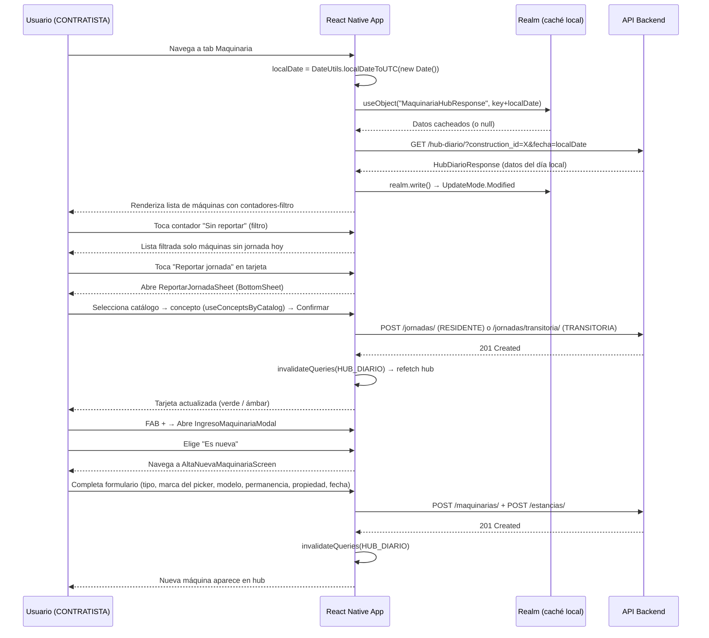

# Registro Diario de Maquinaria

**Creation Date:** 2026-06-08  
**Last Updated:** 2026-06-10  
**Status:** Completed

---

## 1. Business & Experience Context (Product / UX)

- **Primary Goal:** Permitir a los ingenieros de campo (rol CONTRATISTA) registrar el estado diario de cada máquina en obra con el mínimo de fricción posible. El objetivo es que el reporte sea un hábito diario, no una tarea administrativa. Cada interacción debe resolverse en 1–2 taps desde el hub central.

- **User Journey:**
  1. El usuario abre la app y navega a la tab **Maquinaria** (ícono excavadora, solo visible para CONTRATISTA).
  2. Ve el **Hub Diario**: resumen de maquinaria total / reportada / sin reportar / sin operar. Los contadores actúan también como **filtros interactivos** — tocar uno filtra las tarjetas por ese estado; volver a tocar limpia el filtro.
  3. Por cada tarjeta pendiente puede: **Reportar jornada** (trabajando) | **Sin operar** (inactiva con motivo) | **Registrar salida** (botón en la esquina superior derecha de la tarjeta).
  4. Si una máquina lleva días sin reporte, aparece un banner rojo de **Reconciliación** que fuerza a definir qué ocurrió.
  5. Para agregar maquinaria: toca el FAB `+` → modal bottom-sheet → elige entre **Es nueva** (navega a formulario) o **Sí, reactivarla** (busca en historial → asigna fecha de ingreso).

- **Business Rules / Edge Cases:**
  - Una máquina puede estar en modo RESIDENTE (estancia continua) o TRANSITORIA (entra y sale en el mismo día, sin estancia persistente). Los endpoints de jornada difieren: RESIDENTE usa `POST /jornadas/` con `estancia_id`; TRANSITORIA usa `POST /jornadas/transitoria/` con `maquinaria_id`.
  - Solo puede haber **una jornada por máquina por día**. El backend rechaza duplicados.
  - Las tarjetas con `requiere_reconciliacion: true` bloquean visualmente el flujo hasta que el usuario decide el estado real de la máquina (sigue en obra / salió / en reparación / posponer).
  - Sin conexión: el hub muestra el último estado cacheado en Realm. Las **mutaciones requieren conexión** (no existe cola offline para maquinaria, a diferencia del módulo de Avances).
  - En el primer arranque tras la migración de schema (Realm v8 → v9) puede ocurrir un error transitorio "realm closed" durante la escritura del caché. El hook retorna los datos de la API de todos modos y no lanza excepción; el caché se escribe en el siguiente ciclo.
  - **Zona horaria**: El backend opera en UTC. El hub siempre se pide con `fecha` explícita en hora local del dispositivo para evitar que después de la medianoche UTC (p.ej. 18:00 CDMX) el backend responda con datos del día siguiente.

---

## 2. Architecture & Data (The Bridge)

### Endpoints & Services Used

| Método  | Endpoint                                                              | Descripción                                                                                                                   |
| ------- | --------------------------------------------------------------------- | ----------------------------------------------------------------------------------------------------------------------------- |
| `GET`   | `/api/maquinaria/hub-diario/?construction_id={id}&fecha={YYYY-MM-DD}` | Estado diario completo: resumen + lista de máquinas con estancia y jornada de hoy. `fecha` es la fecha local del dispositivo. |
| `GET`   | `/api/maquinaria/tipos/`                                              | Catálogo de tipos de maquinaria (cacheado en Realm, staleTime 30 min)                                                         |
| `GET`   | `/api/maquinaria/maquinarias/?construction_id={id}`                   | Lista completa de máquinas registradas en la obra (para pantalla de reactivación)                                             |
| `POST`  | `/api/maquinaria/maquinarias/`                                        | Alta de nueva maquinaria                                                                                                      |
| `POST`  | `/api/maquinaria/estancias/`                                          | Ingreso de máquina a obra (crea estancia activa)                                                                              |
| `PATCH` | `/api/maquinaria/estancias/{id}/`                                     | Cierre de estancia (salida definitiva o temporal)                                                                             |
| `POST`  | `/api/maquinaria/jornadas/`                                           | Reporte de jornada diaria para maquinaria RESIDENTE                                                                           |
| `POST`  | `/api/maquinaria/jornadas/transitoria/`                               | Reporte one-shot para maquinaria TRANSITORIA (sin estancia)                                                                   |
| `POST`  | `/api/maquinaria/reconciliaciones/`                                   | Registrar decisión de reconciliación para máquina con días sin reporte                                                        |
| `GET`   | `/api/conceptos/?catalog={id}&page_size=200`                          | Conceptos filtrados por catálogo (reutiliza endpoint del módulo Avances)                                                      |

### Main Data Models

**`MaquinariaHubItemRealm`** (embedded) — fila del hub, desnormalizada para evitar objetos embedded anidados opcionales en Realm:

| Campo                     | Tipo      | Origen                            |
| ------------------------- | --------- | --------------------------------- |
| `id`                      | `int`     | `maquinaria.id`                   |
| `tipo`, `marca`, `modelo` | `string`  | identificadores visuales          |
| `propietario_tipo`        | `string`  | PROPIA / RENTADA / SUBCONTRATISTA |
| `tipo_permanencia`        | `string`  | RESIDENTE / TRANSITORIA           |
| `estancia_id`             | `int`     | `estancia_actual.id`              |
| `estancia_fecha_ingreso`  | `string`  | YYYY-MM-DD                        |
| `jornada_id?`             | `int?`    | null si aún no reportó hoy        |
| `jornada_estado?`         | `string?` | TRABAJANDO / SIN_OPERAR           |
| `requiere_reconciliacion` | `bool`    | flag del backend                  |
| `dias_sin_reporte`        | `int`     | días sin jornada                  |

**`MaquinariaHubResponse`** (top-level, primaryKey `"maquinariaHubDiario-{constructionId}-{localDate}"`) — wrapper del hub completo con `fecha`, `total_en_sitio`, `reportadas_hoy`, `sin_reportar`, `sin_operar`, `maquinarias[]`. La clave incluye la fecha local para que el caché del día anterior no se sirva como hoy.

**`TiposMaquinariaResponse`** (top-level, primaryKey `"tiposMaquinaria"`) — singleton; lista embebida de tipos para el dropdown del formulario de alta.

**`MARCAS_MAQUINARIA`** (constante estática, `src/modules/maquinaria/constants/marcasMaquinaria.ts`) — lista de 20 marcas con `{ id, slug, name }`. El `slug` (p.ej. `"caterpillar"`) es lo que se envía al backend; `name` es lo que ve el usuario. Dato estático al ser un dataset de baja dinámica en el MVP.

### Interaction Flow (Diagram)



---

## 3. Technical Implementation Details

### Reusable Components

| Componente               | Ruta                                                           | Uso potencial fuera del módulo                                                                        |
| ------------------------ | -------------------------------------------------------------- | ----------------------------------------------------------------------------------------------------- |
| `MaquinariaCard`         | `src/modules/maquinaria/components/MaquinariaCard.tsx`         | Cualquier pantalla que liste maquinaria con estado de jornada                                         |
| `HubResumenHeader`       | `src/modules/maquinaria/components/HubResumenHeader.tsx`       | Dashboard ejecutivo de obra; acepta `activeFilter` y `onFilterPress` para filtrado interactivo        |
| `ReconciliacionModal`    | `src/modules/maquinaria/components/ReconciliacionModal.tsx`    | Resolución de discrepancias (patrón reutilizable para otros recursos)                                 |
| `IngresoMaquinariaModal` | `src/modules/maquinaria/components/IngresoMaquinariaModal.tsx` | Modal bottom-anchored para decisiones binarias con descripción (patrón reutilizable)                  |
| `DateInput`              | `src/components/ui/DateInput.tsx`                              | Cualquier formulario con campo de fecha; muestra `"09 de junio de 2026"`, recibe y emite `YYYY-MM-DD` |

### State Management

No hay Redux slice para Maquinaria. La decisión fue mantener todo en **React Query + Realm**:

- **Lectura reactiva**: `useObject(MaquinariaHubResponse, key)` devuelve datos de Realm; cualquier escritura posterior (incluso desde otra instancia) actualiza el componente automáticamente.
- **Caché de servidor**: React Query gestiona `staleTime`, reintento y deduplicación de peticiones. La query key incluye la fecha local (`[HUB_DIARIO, constructionId, localDate]`) para que un cambio de día invalide el caché automáticamente.
- **Invalidación**: Todas las mutaciones llaman `queryClient.invalidateQueries({ queryKey: [HUB_DIARIO] })` en `onSuccess`, lo que dispara un refetch del hub y actualiza la UI sin estado manual.
- **Estado local de sheets**: Cada bottom sheet gestiona su propio estado con `useState`. El reset al cambiar de ítem usa el patrón **"setState during render"** (React docs) en lugar de `useEffect` para ser compatible con React Compiler:
  ```tsx
  const currentItemId = item?.estancia_id ?? null;
  if (currentItemId !== lastItemId) {
    setLastItemId(currentItemId);
    setMotivo(null); // reset form
  }
  ```

### Design Patterns & Key Decisions

**1. Esquema Realm desnormalizado**  
`MaquinariaHubItemRealm` aplana los objetos `estancia_actual` y `jornada_hoy` en campos planos. La alternativa (objetos embedded anidados) requiere marcar todos los campos como opcionales (`?`) y gestionar nulos en cascada en la UI. Con el aplanado, la tarjeta accede directamente a `item.jornada_estado` sin guards.

**2. `IngresoMaquinariaModal` en lugar de `Alert.alert` nativo**  
La decisión de ingreso ("¿nueva o reactivar?") usa un modal bottom-anchored personalizado (`IngresoMaquinariaModal`) que sigue la estética del proyecto. El `Alert.alert` nativo fue descartado por romper la coherencia visual y presentar los botones en orden inverso al esperado. El modal sigue el mismo patrón que `InfoDetailModal`: `animationType="slide"`, `justifyContent: "flex-end"`, bordes superiores redondeados, handle bar y backdrop táctil para cerrar.

**3. `BottomSheetBackdrop` con `useAnimatedReaction`**  
La causa raíz del bloqueo de toques: el `TouchableWithoutFeedback` del backdrop era el elemento exterior, y permanecía activo aunque el sheet estuviera cerrado. La corrección invierte la jerarquía — `Animated.View` es el exterior con `pointerEvents` controlado por un estado JS derivado del valor animado vía `runOnJS`:

```tsx
useAnimatedReaction(
  () => animatedIndex.value > -1,
  (isActive) => runOnJS(setActive)(isActive),
);
// En render:
<Animated.View pointerEvents={active ? "box-none" : "none"}>
  <TouchableWithoutFeedback>...</TouchableWithoutFeedback>
</Animated.View>;
```

Este fix beneficia a **todos** los bottom sheets del app que usen este componente.

**4. `useConceptsByCatalog` — conceptos sin workItem**  
`ReportarJornadaSheet` necesita conceptos filtrados por catálogo, no por partida de obra. Se creó `useConceptsByCatalog` que reutiliza el schema `ConceptsByWorkItemResponse` con un prefijo de clave distinto (`concepts-by-catalog-{catalogId}`) para evitar una migración de Realm. El guard `isInitialLoading: !!catalogId && !cached && q.isPending` previene el spinner infinito cuando ningún catálogo está seleccionado (query disabled → `isPending: true` permanente sin el guard).

**5. Marcas como dato estático (`MARCAS_MAQUINARIA`)**  
El campo `marca` usa una lista estática de 20 marcas en lugar de un endpoint. Decisión MVP: el catálogo de marcas es de baja dinámica y no justifica una tabla backend. Cada entrada tiene `slug` (lo que va al API, p.ej. `"caterpillar"`) y `name` (lo que ve el usuario, p.ej. `"Caterpillar (CAT)"`). Si el backend agrega una tabla de marcas en el futuro, el slug es el candidato natural como foreign key. El picker usa `quickSelect: true` para selección directa sin expand/collapse, a diferencia del picker de conceptos que necesita ver textos largos.

**6. Trigger de marca como `TouchableOpacity` nativo**  
El campo `marca` no usa `SearchableDropdown` como trigger visual sino un `TouchableOpacity` con `styles.input` (el mismo estilo que el campo `modelo` adyacente). El `SearchableDropdown` usa `react-native-paper TextInput` internamente (Material Design, más alto), lo que creaba una diferencia visual en la misma fila. El trigger nativo abre el mismo modal `SearchablePicker` vía `useModal`.

**7. `HubResumenHeader` como header full-width + filtros**  
El header usa `marginHorizontal: -sp(DesignTokens.spacing.md)` para cancelar el padding del `FlatList` y lograr ancho completo de pantalla mientras sigue siendo parte del scroll. Los 4 contadores son `TouchableOpacity` que actúan como filtros: tocar uno activa la vista filtrada (pill semitransparente + indicador blanco), volver a tocarlo la limpia. El contador "En sitio" siempre limpia el filtro.

**8. React Compiler — sin `useMemo` manual**  
El proyecto tiene React Compiler habilitado. El compilador infiere sus propias dependencias y conflicta con `useMemo` manual cuando las dependencias declaradas difieren de las inferidas. El filtrado de `maquinarias` en `HubDiarioScreen` usa una expresión ternaria directa sin `useMemo`; el compilador la memoiza automáticamente. Regla a seguir en todo el módulo: no usar `useMemo`/`useCallback` salvo para callbacks estables que se pasan como props.

**9. Corrección UTC — fechas locales del dispositivo**  
El backend opera en UTC. `new Date().toISOString().split("T")[0]` devuelve la fecha UTC, no la local. A partir de ~18:00 CDMX (UTC-6 CDT) la fecha UTC ya es el día siguiente. Todos los valores por defecto de fecha usan `DateUtils.localDateToUTC(new Date())`, que extrae `getFullYear/Month/Date()` (hora local del dispositivo) y los serializa como `YYYY-MM-DD`. El hub se pide siempre con `fecha=localDate` explícita para que el backend responda con datos del día local del usuario. Cuando el backend implemente soporte de timezone propio, el parámetro `fecha` del hub se vuelve innecesario y puede eliminarse sin afectar el resto del flujo.

**10. Realm write no-throw en queryFn**  
Las funciones `queryFn` de `useHubDiario` y `useTiposMaquinaria` capturan la instancia de `realm` en el closure. Si Realm se cierra entre el inicio de la petición y la respuesta (p.ej. durante la migración de schema en primer arranque), el `realm.write()` lanza. El handler hace `return data` en lugar de `throw error`, por lo que React Query registra el query como exitoso y el caché en memoria funciona. El caché Realm se popula en el siguiente ciclo.

### New Environment Variables

Ninguna. El módulo usa el mismo `apiClient` y credenciales Azure AD ya configuradas.

---

## 4. Technical Debt & TODOs

- **Sin cola offline para mutaciones**: A diferencia del módulo de Avances (que tiene `PendingAdvanceSubmission` en Realm y un sync worker), las mutaciones de maquinaria requieren conexión. Si el ingeniero intenta reportar sin internet, la mutación falla sin feedback claro. Pendiente: implementar `PendingMaquinariaSubmission` + worker similar al de Avances.

- **`RealmWipeHandler` en RealmProvider**: El bloque comentado en `src/providers/RealmProvider.tsx` debe eliminarse una vez confirmado el despliegue sin problemas de la migración v9. Aplica al módulo de Maquinaria y a cualquier módulo futuro.

- **Sin cobertura de tests**: No existe suite de tests configurada en el proyecto. Los flujos críticos sin test incluyen: lógica de `flattenHubItem`, validación Zod del formulario de alta, y la máquina de estados de `MaquinariaCard`.

- **`ReportarJornadaSheet` — "Repetir ayer" incompleto**: El botón hace un fetch de `GET /jornadas/?estancia_id=X` para pre-rellenar catálogo/concepto, pero si la última jornada fue de tipo `SIN_OPERAR` el pre-relleno no aplica y el formulario queda en blanco. Pendiente: manejar este caso con un mensaje aclarativo.

- **`MARCAS_MAQUINARIA` como dato estático**: La lista de marcas vive en el cliente. Si el catálogo crece o cambia, requiere una actualización de la app. Cuando el backend añada una tabla de marcas, migrar a un endpoint y eliminar la constante.

- **Fecha UTC en el hub al soportar timezones**: Cuando el backend implemente zonas horarias propias, el parámetro `fecha` que enviamos al hub (`getHubDiario(constructionId!, localDate)`) deja de ser necesario. Eliminar el argumento en `maquinariaApi.ts` y la lógica de `localDate` en `useHubDiario.ts`.
