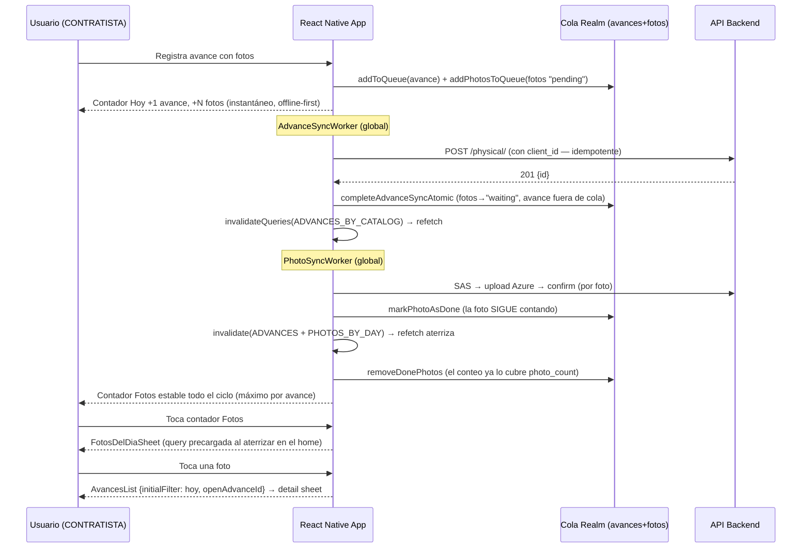

# Sábana como Home — Fase 1

**Creation Date:** 2026-07-16
**Last Updated:** 2026-07-17
**Status:** Completed (alcance Fase 1 sin láminas L-02/L-03, diferidas por enmienda E4 del ADR-003)

> Documento de implementación. Las decisiones y su razonamiento viven en
> `docs/adr/ADR-003-sabana-home-fase1.md` (frontend) y `docs/ADR/ADR-002-agregado-obra-fotos-avances.md`
> (backend). Referencia visual: `docs/ux/ux-spec-01.html` (UX-SPEC-01 Rev D).

---

## 1. Business & Experience Context (Product / UX)

- **Primary Goal:** Convertir la sábana de avance —el único artefacto que el contratista reconoce sin entrenamiento— en el home y punto de partida de todo su flujo diario. La telemetría de adopción mostró que la app se usaba como sustituto del Excel nocturno (hora promedio de registro: 17:37) y no como herramienta de campo; esta fase reordena la navegación alrededor del flujo real: capturar en campo → cerrar el día → entregar el reporte al cliente.

- **User Journey:**
  1. El usuario (rol CONTRATISTA) abre la app y aterriza en la tab **Sábana** (4 tabs: Sábana · Reportes · Maquinaria · Perfil; las tabs Avances e Incidencias desaparecieron).
  2. Lo primero que ve es la **franja "Hoy"** (zona oscura ejecutiva): fecha, obra, `AVANCE %` global con barra e importes Ejecutado/Contratado, tres contadores tocables (Avances · Fotos · Incidencias) y dos acciones: **Reporte del día** e **Incidencia**. La franja viaja con el scroll — al bajar, la sábana toma el 100% de la pantalla.
  3. Los contadores **navegan, jamás filtran el árbol in situ**: Avances → historial con filtro de hoy; Fotos → galería del día (bottom sheet, grid agrupado por partida › sección, pie de foto con hora de toma); Incidencias → lista de incidencias con filtro de hoy.
  4. **Reporte del día** navega cross-tab a Reportes → `AdvanceReport` con `dateFrom = dateTo = hoy` precargado (el momento de valor de la app a un tap del home).
  5. El **historial** (`AdvanceListScreen`, ahora dentro del stack de Sábana) agrupa por día local ("Hoy · viernes 17 de julio", "Ayer · …") con el volumen como protagonista de cada card; su FAB simple lleva al formulario clásico de registro.
  6. El **detalle de avance** (bottom sheet compacto) muestra contexto en una sola cejilla (`catálogo · partida › sección · wbs`), la evidencia fotográfica en franja horizontal —tap en un thumbnail abre el **visor a pantalla completa** con swipe y zoom— y conserva la edición inline de volumen/comentario.
  7. Tap en una foto de la galería del día abre el avance que la respalda (historial → detail sheet).

- **Business Rules / Edge Cases:**
  - **Contadores del Hoy = servidor + cola offline.** Lo capturado cuenta desde el instante de la captura (cola Realm), haya o no señal. Las incidencias no tienen cola offline: su contador es solo-servidor y muestra `—` sin dato.
  - **Porcentajes sin recorte:** la sobre-ejecución se muestra tal cual (>100%), con piso en 0; solo las barras se recortan visualmente al 100% de ancho (enmienda E2 del ADR).
  - **Vocabulario reservado:** "Importe" = volumen ejecutado × PU. La palabra "financiero" queda reservada al módulo de estimaciones futuro.
  - **Estados PENDING/APPROVED/REJECTED** visibles en historial y detalle (señal del flujo futuro con INSPECTOR); ausentes de la franja Hoy.
  - **Offline:** la franja muestra banner "Sin conexión — contadores con datos locales"; la línea de obra (agregado de backend) se oculta sin dato; la galería del día es solo-online con estado explícito (la evidencia por avance del historial es la vista offline).
  - **Fechas de negocio siempre vía `DateUtils`** (D9 del ADR): nunca `new Date("YYYY-MM-DD")` ni `toISOString().split("T")[0]` — ambos corren el día en CDMX a partir de ~18:00.
  - **Cambio de asignación de obra** (o cambio de usuario en el mismo dispositivo): el primer request del summary puede responder 404 con el id cacheado del usuario/obra anterior; es transitorio y no reintenta — el refetch de `my_constructions` re-apunta todo al id vigente.

---

## 2. Architecture & Data (The Bridge)

### Endpoints & Services Used

| Método | Endpoint                                                                          | Descripción                                                                                                                                       |
| ------ | --------------------------------------------------------------------------------- | -------------------------------------------------------------------------------------------------------------------------------------------------- |
| `GET`  | `/api/avance/construction/{id}/summary/`                                          | **Nuevo (ADR-002 backend).** Agregado global de obra `{pct_fisico, importe_ejecutado, importe_contratado}`, fórmula ponderada por importes, sin filtro de status, pct sin recorte |
| `GET`  | `/api/avance/physical/?catalog={id}&detailed=true&page_size=100`                  | Lista de avances. El serializer detailed ahora expone `photo_count`, `photos[]` (URLs SAS de lectura, solo COMPLETED), `concept_wbs_code`, `concept_section_name` |
| `POST` | `/api/avance/physical/`                                                           | Registro de avance. Acepta `client_id` (UUID de la cola offline): reintento con el mismo id responde el registro existente (200) — **create idempotente** |
| `GET`  | `/api/avance/photos/?construction_id={id}&date_from&date_to&upload_status=COMPLETED` | Fotos de la obra para la galería del día. `date_from/date_to` truncan `uploaded_at` a fecha UTC → se pide rango ±1 día y se afina en cliente        |
| `GET`  | `/api/incidencias/incidents/?date_after={ayer}&page_size=100`                     | Incidencias para el contador del Hoy (afinado a "hoy local" en cliente con `DateUtils`)                                                            |
| `GET`  | `/api/obra/constructions/my_constructions/?role=CONTRATISTA`                      | Obra asignada (fuente del `constructionId` de toda la pantalla)                                                                                    |
| `GET`  | `/api/reportes/physical-advance/?construction_id&date_from&date_to&scope`         | Excel del reporte; "Reporte del día" llega con el rango de hoy en **fecha local** (fix UTC)                                                        |

### Main Data Models

**`PhysicalAdvanceResponse`** (Realm embedded, cache `AvancesByCatalogResponse`, schemaVersion 11) — campos nuevos de esta fase, todos opcionales para compatibilidad con backend viejo:

| Campo                  | Tipo              | Origen / uso                                                        |
| ---------------------- | ----------------- | ------------------------------------------------------------------- |
| `photo_count?`         | `int?`            | Indicador 📷 de la card y contador Fotos del Hoy                    |
| `photos?`              | `AdvancePhoto[]`  | Franja de evidencia del detalle y visor a pantalla completa         |
| `concept_wbs_code?`    | `string?`         | Cejilla de la card (`partida · wbs`) y bloque de contexto           |
| `concept_section_name?`| `string?`         | Bloque de contexto (`partida › sección`) y agrupación de la galería |

**`AdvancePhoto`** (Realm embedded, registrado en esta fase) — `{ id, url, thumbnail_url, created_at }`. Las URLs traen token SAS de lectura de 24 h generado por el backend en cada respuesta.

**`PendingPhotoSubmission`** (cola offline de fotos) — flujo de estados extendido:
`pending → waiting → syncing → done → (eliminada)`, con `uploaded` (subida sin confirmar, reintenta solo confirmación) y `failed` como desvíos. **`done`** es nuevo (enmienda E5): subida y confirmada, se conserva en la cola *solo* hasta que el refetch de avances refleja el `photo_count` nuevo — así el contador nunca cuenta hacia abajo. Es un valor de string: no requirió migración de esquema.

**`ConstructionSummaryResponse` / `ConstructionPhoto`** (`src/types/avance.d.ts`) — contratos TS del agregado de obra y del item de la galería.

### Interaction Flow (Diagram)

---

## 3. Technical Implementation Details

### Reusable Components

| Componente             | Ruta                                                      | Uso potencial fuera del módulo                                                     |
| ---------------------- | --------------------------------------------------------- | ----------------------------------------------------------------------------------- |
| `HoyResumenHeader`     | `src/modules/avance/components/HoyResumenHeader.tsx`      | Franja ejecutiva de día para cualquier hub (patrón heredado de `HubResumenHeader`)  |
| `SabanaCatalogMetrics` | `src/modules/avance/components/SabanaCatalogMetrics.tsx`  | Línea compacta de métricas (pct + importe + barra) bajo cualquier selector          |
| `QueueHeaderButton`    | `src/modules/avance/components/QueueHeaderButton.tsx`     | Ícono de nube con badge de cola para cualquier header de stack                      |
| `FotosDelDiaSheet`     | `src/modules/avance/components/FotosDelDiaSheet.tsx`      | Galería en sheet agrupada por sección; patrón de grid + breadcrumb reutilizable     |
| `AdvanceItemCard`      | `src/modules/avance/components/AdvanceItemCard.tsx`       | Card de registro con protagonista tipográfico + metadatos etiquetados               |
| `formatCurrency`       | `src/modules/avance/utils/formatCurrency.ts`              | Formato compacto de importes (`$4.2M`, `$3.1K`) para toda la zona de avance         |

### State Management

Sin Redux nuevo. Todo el estado de datos vive en **React Query + Realm**, con una regla transversal que esta fase dejó establecida:

- **Los workers invalidan lo que mutan.** El proyecto tiene `refetchOnMount: false` global (decisión de ahorro de datos en campo): navegar NO refresca nada. Los únicos disparadores automáticos de refetch son la reconexión (`refetchOnReconnect`) y las invalidaciones dirigidas. Como en esta arquitectura offline-first las pantallas no escriben al servidor (escriben a la cola, y los workers empujan), **el worker es el único componente que sabe el instante en que el servidor cambió** — por eso el `AdvanceSyncWorker` invalida `ADVANCES_BY_CATALOG` al sincronizar, y el `PhotoSyncWorker` invalida `ADVANCES_BY_CATALOG` + `PHOTOS_BY_DAY` al terminar un lote de subidas.
- **`useTodaySummary`** (`src/modules/avance/hooks/useTodaySummary.ts`) deriva los contadores del Hoy: avances = sincronizados de hoy (cache Realm, rango UTC del día local) + items de cola de hoy; **fotos = máximo por avance** entre `photo_count` del servidor y fotos en cola de ese avance (incluyendo `done`) + fotos aún no ligadas — inmune por construcción a sub-conteos y dobles conteos durante la sincronización; incidencias = solo servidor (`number | null`).
- **Filtros iniciales por ruta:** `useDateRangeFilter(initialValue)` acepta el `DateFilter` que llega en `route.params.initialFilter` (contadores del Hoy → historial/incidencias con rango de hoy). El filtro "hoy" se construye con `DateUtils.getTodayUTCRange()` (rango UTC del día local).
- **Estado local de sheets:** mismo patrón del módulo (`useState` + `useEffect(isVisible)` sobre `@gorhom/bottom-sheet`). El detail sheet guarda una **copia plana** del avance (`toJSON()` de Realm) — nunca el objeto vivo, que se invalida con cada reescritura del cache.

### Design Patterns & Key Decisions

**1. Navegación: stacks absorbidos, no pantallas nuevas**
`SabanaStackParamList` absorbió `AvancesList` (con `initialFilter`/`openAdvanceId`), `AvanceRegistration`, `PendingSync`, `IncidentsList` (con `initialFilter`) e `IncidentRegistration`; la tab Reportes es un stack nuevo (`ReportSelection → AdvanceReport` con `dateFrom/dateTo` opcionales). `AvanceNavigator` e `IncidenciaNavigator` se eliminaron. La navegación cross-tab usa `NavigatorScreenParams` (`navigate("Reportes", { screen, params })`).

**2. Conteo por máximo + estado `done` (anti-escalera del contador Fotos)**
La suma ciega `cola + servidor` sub-cuenta durante la subida: cada foto salía de la cola al confirmar, pero `photo_count` solo llega con el refetch (síntoma real: 3→2→1→3). El arreglo tiene dos mitades: la foto exitosa pasa a `done` y **solo se elimina después de que el refetch aterrizó** (`invalidateQueries` espera a las queries activas → `removeDonePhotos()`); y el contador usa `max(photo_count, fotosEnCola)` **por avance** — si ambas fuentes ven la misma foto, el máximo la cuenta una vez; si una va atrasada, la otra la cubre. Hay limpieza de arranque para sesiones que mueren a media subida (invalida primero, borra después; offline las `done` son inocuas).

**3. Idempotencia de envío (`client_id`)**
El worker envía el `_id` UUID que la cola ya genera; el backend tiene `Physical.client_id` unique nullable y responde el registro existente ante un reintento (respuesta perdida en red de obra ya no duplica avances — y con ellos importes y porcentajes). Compatible con clientes viejos que no lo envían.

**4. Porcentajes sin recorte, barras con clamp visual**
`conceptPct`/`rollupPct`/`computeGlobalStats` y el agregado de backend muestran el valor real (piso 0, sin techo). El recorte al 100% existe solo en el `width` de las barras (`Math.min(100, pct)` en estilo).

**5. Fechas: patrón D9 aplicado**
`AdvanceReportScreen.toISODate` ahora formatea componentes locales (date-fns `format(date, "yyyy-MM-dd")`); el detail sheet usa `useFormattedDate`; `useAdvanceListData` recibe strings ISO y filtra/ordena con `DateUtils.isDateInUTCRange`/`compareUTCDates`; los params de fecha de ruta se parsean por componentes (`parseLocalDateParam`), nunca con `new Date(string)`.

**6. Realm: tres correcciones de ciclo de vida descubiertas en pruebas**
(a) **Identidad estable de la configuración del provider**: `@realm/react` compara su config en cada re-render (deep compare; funciones por referencia) y ante un "cambio" **cierra y reabre el Realm** — el `onMigration` inline provocaba carreras "Cannot access realm that has been closed" al volver del background. `SENTINEL_SCHEMA` y `handleMigration` viven ahora a nivel de módulo. (b) La prop correcta es `onMigration` — el nombre anterior (`migration`) era ignorado y las migraciones v8/v10 nunca corrieron por esa vía. (c) **Todos los stores de avance** devuelven los datos de la API sin cachear si la escritura a Realm falla en pleno vuelo (patrón `useHubDiario`), en lugar de tronar.

**7. Detach de objetos Realm hacia estado React**
`useBottomSheet.openBottomSheet` guarda `advance.toJSON()` (copia plana profunda, fotos incluidas). Guardar el objeto embebido vivo crasheaba con "Accessing object which has been invalidated" cuando un refetch reescribía el cache con el sheet abierto.

**8. Galería solo-online con precarga y cache efectivo**
`useTodayPhotos` arranca al montar el sheet (aterrizaje en el home), no al abrirlo — la lista ya está lista al primer tap. Las URLs de thumbnail se **estabilizan por id de foto**: el token SAS viaja en la URL y cambia en cada respuesta, así que el cache de imágenes del dispositivo nunca acertaba; conservando la primera URL vista (SAS de 24 h; la query key es del día local) cada thumbnail se descarga una vez al día. El "hoy" de la galería se define por **join en cliente** contra los avances de hoy (misma definición que el contador); el pie de foto muestra la hora local de **toma** (`taken_at`, fallback `uploaded_at`) vía `DateUtils.formatUTCForDisplay` — función estática, segura dentro de un `map`.

**9. Visor de fotos a pantalla completa**
`react-native-image-viewing` (JS puro, sin módulos nativos — no exige recompilar el dev build; sus dependencias pesadas, reanimated y gesture-handler, ya estaban por `@gorhom/bottom-sheet`). Swipe entre fotos del avance, pinch/doble-tap zoom, swipe-down para cerrar, contador `N / M`. Usa `photo.url` (imagen completa) con fallback al thumbnail.

**10. Historial como `SectionList` por día local**
Agrupación con clave `format(DateUtils.parseUTCDate(date), "yyyy-MM-dd")`; el título de sección compone `useRelativeDate` + fecha completa ("Hoy · viernes 17 de julio"). `openAdvanceId` (llegada desde la galería) abre el detail sheet vía efecto y limpia el param con `setParams` para no re-disparar.

**11. `page_size=100` en avances**
`getAdvancesByCatalog` no pedía tamaño de página y la paginación default del backend (15) truncaba silenciosamente el historial y el cache offline. Se pide el máximo permitido; la paginación real sigue pendiente (TODO existente de `handleLoadMore`).

### New Environment Variables

Ninguna. Dependencia nueva: `react-native-image-viewing` (JS puro). Backend: migración `avance.0009` (`Physical.client_id`) — correr `manage.py migrate` antes de distribuir el build.

---

## 4. Technical Debt & TODOs

- **Contador de Avances optimista (deuda #11 del ADR-003):** en lotes grandes post-offline el contador se hunde y se recupera por escalones (9→5-6-7→9) porque los items salen de la cola al confirmar y el cache avanza a saltos de refetch. Norte acordado: *optimistic UI* — replicar el patrón `done` en la cola de avances (marcar en vez de borrar dentro de `completeAdvanceSyncAtomic`, `physicalAdvanceId` en el item, dedup por id, blindar badge de nube / `PendingSyncScreen` / worker / telemetría). Diferido: toca el corazón atómico del motor congelado por el ADR y exige pruebas de rutas de crash; ejecutar junto con la consolidación de colas (deuda #4). **Interim de riesgo ~0 disponible:** invalidación por item en el loop del worker (escalera → parpadeos de −1 de ~1 s).
- **Cache local no se limpia al cambiar de usuario (deuda #12):** Realm y el cache persistido de React Query sobreviven al logout; otro usuario en el mismo dispositivo ve datos del anterior hasta que los refetches aterrizan (observado en pruebas: 404 del summary con la obra cacheada del usuario previo). Pendiente: wipe ligado al cambio de identidad.
- **`expo-image` con `cacheKey` por id de foto (deuda #13):** la estabilización de URL cubre la galería; la franja de evidencia del detalle aún re-descarga con cada SAS nueva. Migrar ambas cuando convenga recompilar el dev build (módulo nativo).
- **URLs SAS de 24 h offline:** una foto vista desde cache con más de 24 h sin conexión responde 403 hasta el siguiente refetch. Mitigación posible: reintento con refetch al fallar la carga, o extender `expiry_hours` en backend (un parámetro).
- **Invalidación local no bastará con múltiples escritores:** el modelo "los workers invalidan lo que mutan" asume que este dispositivo es el único escritor de los datos del contratista. Cuando el INSPECTOR (u otro actor) mute los mismos datos, hará falta revalidación periódica o push del servidor.
- **L-02/L-03 diferidas (enmienda E4):** `ConceptoSheet`, `CapturaRapidaSheet`, gestos de fila (D4) y sus eventos de telemetría llegan con el cierre de esas láminas en el UX-SPEC.
- **Errores TS/lint preexistentes de la base:** 6 grupos de errores de `tsc` (ServerErrorModal, PersistGateLoader, useAvanceBase, useGoogleAuth, useSabanaData, ModalRenderer) y hallazgos de lint (`failCount` sin uso, setState-en-efecto del detail sheet) anteriores a esta fase. Esta fase no agregó ninguno; limpieza aparte pendiente.
- **Sin cobertura de tests en frontend:** los flujos críticos sin test incluyen `useTodaySummary` (fórmula de máximo), el ciclo `done` del `PhotoSyncWorker` y la agrupación por día del historial. El backend sí ganó suite (12 tests en `avance/tests.py`, `manage.py test avance --settings=core.test_settings`).
- **Paginación real del historial:** `handleLoadMore` sigue siendo TODO; con >100 avances por catálogo el historial vuelve a truncarse.
